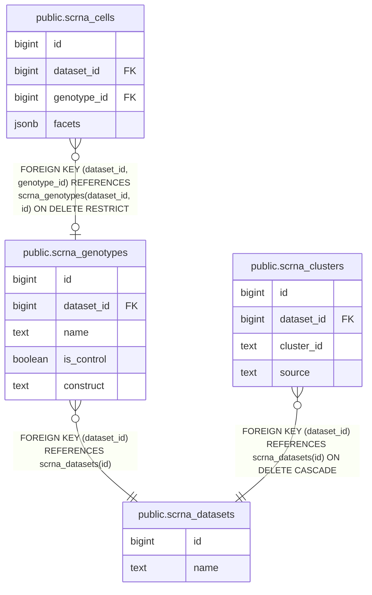

# PR Description Template

Standardized template for Bloom pull request descriptions.

## Template

```markdown
## Summary

[1-3 sentences describing what this PR does and why]

## Changes

- [Bullet list of specific changes]

## Testing

- [ ] Integration tests pass: `uv run --extra test pytest tests/integration/ -v --tb=short`
- [ ] TypeScript type check passes: `cd web && npx tsc --noEmit`
- [ ] Next.js build succeeds: `cd web && npm run build`
- [ ] Docker images build: `docker compose -f docker-compose.prod.yml build`

## Type Checking & Linting

- [ ] `npm audit --audit-level=critical` — no critical CVEs
- [ ] `cd web && npx tsc --noEmit` — no type errors
- [ ] `npm run lint` — no ESLint errors (optional, not in CI)
- [ ] Python linting clean (optional, not in CI):
  - `cd langchain && uv run black --check . && uv run ruff check .`
  - `cd bloommcp && uv run black --check . && uv run ruff check .`

## Breaking Changes

[None / Describe any breaking changes and migration path]

## Schema changes

<!-- Delete this section if this PR changes no migrations. -->

<!-- Paste the output of `make erd-snapshot CHANGED=origin/staging` here: a mermaid erDiagram of the tables this PR creates or changes, and their neighbours. -->

| Name | Table | Type | What it refuses | How it is added |
| ---- | ----- | ---- | --------------- | --------------- |

<!--
One row per constraint or index the migrations add. "How it is added" is one of:
drop, then add (CHECK); guarded add (FOREIGN KEY); guarded add that compares the definition
(UNIQUE, PRIMARY KEY, EXCLUDE); inline in CREATE TABLE IF NOT EXISTS; IF NOT EXISTS (index).
Add NOT VALID where existing rows may violate it. Check the section with
`make pr-body-check BODY=<file>`.

If the migrations only drop tables, views or indexes, replace the diagram with a line naming
each one. If they change no table, view, constraint or index, delete the diagram and table
above and keep only this line:
No schema changes.
-->

## Related Issues

Closes #<issue_number>
```

> **Use real closing keywords — one per issue.** Issues only auto-close when the
> PR body contains a keyword (`Closes`/`Fixes`/`Resolves`, etc.) immediately
> before each `#N` — a bare `(#305)` is just a mention and leaves the issue
> open. Because this repo's flow merges feature PRs into `staging` (not the
> default branch), GitHub's native auto-close doesn't fire; the
> `auto-close-issues-on-staging` workflow replicates it, but it reads the **same
> literal keywords**, so the convention is what makes both work. Notes:
>
> - **One keyword per issue:** `Closes #1, closes #2` (not `Closes #1, #2`,
>   which only closes #1).
> - **Keywords are literal:** avoid `does not close #5`, and don't put
>   `Closes #N` inside code blocks or future-work checklists — they'll still
>   trigger a close.
> - **Needs a space:** `Closes: #5` works, `Closes:#5` does not.

> **Schema changes.** A PR that changes migrations must fill this section: the
> ER snapshot from `make erd-snapshot CHANGED=origin/staging`, and one row per
> constraint or index the migrations add. The PR Body Checks workflow checks it
> against the migration SQL; run `make pr-body-check BODY=<file>` before opening
> the PR. `.github/pull_request_template.md` carries the same section for PRs
> opened in the browser; a unit test keeps the two identical.

## Package-Specific Checklists

### LangGraph Agent / FastMCP Changes

If the PR modifies `langchain/` or `bloommcp/`:

- [ ] FastAPI routes follow existing patterns
- [ ] Python dependencies updated in `pyproject.toml` with `uv add` and `uv lock`
- [ ] `uv export | uvx pip-audit` passes on updated requirements
- [ ] Integration tests cover new endpoints
- [ ] Error responses return appropriate HTTP status codes

### Next.js Frontend Changes

If the PR modifies `web/`:

- [ ] Server vs client components correctly separated
- [ ] Supabase client calls use SSR pattern where appropriate
- [ ] `npx tsc --noEmit` passes
- [ ] `npm run build` succeeds
- [ ] Responsive design verified
- [ ] Accessibility: ARIA labels, keyboard navigation

### Database/Supabase Changes

If the PR includes migrations in `supabase/migrations/`:

- [ ] Migration tested locally: `make migrate-local`
- [ ] RLS policies added for new tables
- [ ] TypeScript types regenerated: `make gen-types`
- [ ] Rollback SQL documented (if destructive)
- [ ] Indexes added for queried columns
- [ ] PR changes only the migration surface: migrations, rollbacks, grants, tests, the generated types, `_WIKI` and Markdown
- [ ] `_WIKI/SUPABASE/erd.md` redrawn: `make erd`, or the `erd` artifact from CI
- [ ] Schema changes section filled and `make pr-body-check BODY=<file>` passes

### Docker/Infrastructure Changes

If the PR modifies Dockerfiles or compose files:

- [ ] Both `docker-compose.dev.yml` and `docker-compose.prod.yml` updated consistently
- [ ] Caddy config updated if routing changes
- [ ] Health checks configured for new services
- [ ] Security: `no-new-privileges`, `cap_drop: ALL`, `read_only` where applicable
- [ ] Environment variables documented

## GitHub CLI Commands

```bash
# Check a migration PR's Schema changes section first
make pr-body-check BODY=pr_body.md

# Create PR from a drafted body. `--body` and `--body-file` never load
# .github/pull_request_template.md, so the draft must carry its own sections.
gh pr create --base staging --title "feat: description" --body-file pr_body.md

# View PR
gh pr view <number>

# View PR diff
gh pr diff <number>

# Check CI status
gh pr checks <number>

# Edit PR description
gh pr edit <number> --body "..."
```

## Example PRs

### Feature PR

```markdown
## Summary

Add organism management API endpoints to the LangGraph agent, allowing users to create, read, update, and delete organisms via the web interface.

## Changes

- Add CRUD endpoints in `langchain/routes/organisms.py`
- Add Supabase migration for organisms table with RLS policies
- Add organism list component in `web/app/organisms/page.tsx`
- Add integration test for organism endpoints

## Testing

- [x] Integration tests pass
- [x] TypeScript type check passes
- [x] Docker images build
- [x] Manually tested organism CRUD in dev environment

## Breaking Changes

None
```

### Bug Fix PR

```markdown
## Summary

Fix race condition in Supabase realtime subscription causing stale scan data to display after concurrent uploads.

## Changes

- Add debounce to realtime subscription handler in `web/app/scans/use-scan-subscription.ts`
- Add cleanup on component unmount to prevent memory leak

## Testing

- [x] Integration tests pass
- [x] TypeScript type check passes
- [x] Manually verified with concurrent uploads

## Breaking Changes

None

Closes #87
```

### Migration PR

A migration that adds a genotypes table, links each scRNA cell to its genotype, and records
where a cell type's label came from. Its Schema changes section is what the PR Body Checks
workflow expects.

````markdown
## Summary

Records which genotype each scRNA cell belongs to, so the map can colour and filter cells by genotype.

## Changes

- New `scrna_genotypes` table: one row per genotype a dataset compares
- `scrna_cells.genotype_id` links each cell to a genotype in the same dataset
- `scrna_clusters.source` records where a cell type's label came from

## Testing

- [x] Integration tests for the new constraints pass
- [x] `make pr-body-check BODY=pr_body.md` passes

## Schema changes



| Name                                  | Table           | Type        | What it refuses                                                   | How it is added                        |
| ------------------------------------- | --------------- | ----------- | ----------------------------------------------------------------- | -------------------------------------- |
| `scrna_genotypes_one_per_dataset`     | scrna_genotypes | UNIQUE      | a second genotype with the same name in a dataset                 | inline in `CREATE TABLE IF NOT EXISTS` |
| `scrna_genotypes_id_per_dataset`      | scrna_genotypes | UNIQUE      | nothing new; lets cells reference `(dataset_id, id)`              | inline in `CREATE TABLE IF NOT EXISTS` |
| `scrna_genotypes_name_not_blank`      | scrna_genotypes | CHECK       | a blank name                                                      | inline in `CREATE TABLE IF NOT EXISTS` |
| `scrna_genotypes_construct_not_blank` | scrna_genotypes | CHECK       | a blank construct                                                 | inline in `CREATE TABLE IF NOT EXISTS` |
| `scrna_genotypes_lengths`             | scrna_genotypes | CHECK       | a name over 100, construct over 200 or notes over 2000 characters | inline in `CREATE TABLE IF NOT EXISTS` |
| `scrna_cells_genotype_fkey`           | scrna_cells     | FOREIGN KEY | a cell pointing at another dataset's genotype                     | guarded add                            |
| `scrna_cells_facets_are_flat_text`    | scrna_cells     | CHECK       | facets that are not an object of non-empty strings                | drop, then add                         |
| `scrna_cells_replicate_length`        | scrna_cells     | CHECK       | an over-long replicate label                                      | drop, then add                         |
| `idx_scrna_cells_genotype`            | scrna_cells     | INDEX       | nothing; speeds up filtering cells by genotype                    | `IF NOT EXISTS`                        |

## Breaking Changes

None
````

## Related Commands

- `/pre-merge` — comprehensive pre-merge checklist
- `/review-pr` — review a PR
- `/run-ci-locally` — run CI checks before creating PR
- `/changelog` — update changelog
