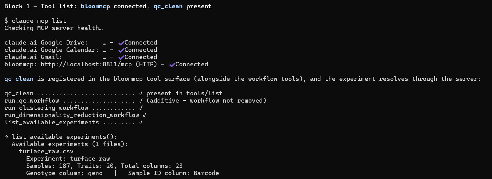
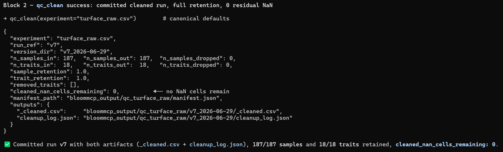
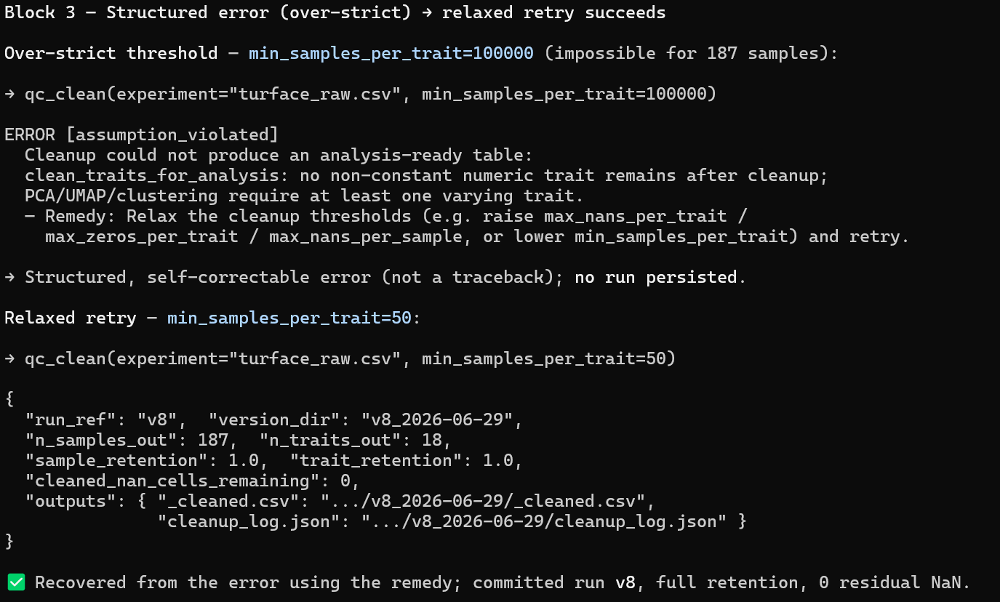
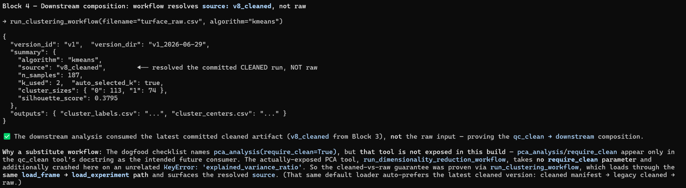

# Local validation — `make bloommcp-smoke`

The Supabase-free unit suite (`uv run pytest`) runs the bloom-mcp tools against in-memory
fakes. **`make bloommcp-smoke`** is the complementary *live* check: it drives real tools
end-to-end through the deployed `SupabaseReader` / `SupabaseResultStore` adapters against a
running dev stack, so CI and local pre-merge prove the real write/read path — not just the
fakes. The same target backs the `dev-stack-smoke` CI job, so local and CI never drift.

## Prerequisites

1. The dev stack is **up and migrated** (the `migrate-local` step creates the
   `bloommcp-data` bucket and applies the storage grants the write path needs):
   ```bash
   make dev-up
   make migrate-local
   ```
   See [DEV_SETUP.md](../../DEV_SETUP.md) for first-time setup (WSL2, `.env.dev`, MinIO).
2. `.env.dev` exists and has a non-empty `BLOOM_AGENT_KEY` (written by `make init`). The
   smoke target sources it and never echoes it.
3. `uv` is installed (the target runs the driver via `uv run`).

## Running

From the **repo root**:

```bash
make bloommcp-smoke
```

The target bridges the host↔container gap: `.env.dev` points `SUPABASE_URL` at the
in-container gateway (`http://kong:8000`) and `BLOOM_*_DIR` at `/app` paths, so the target
derives the host gateway from `KONG_HTTP_PORT` (`http://localhost:$KONG_HTTP_PORT`) and seeds
host temp dirs with the test fixtures before launching
[`scripts/live_persistence_smoke.py`](../scripts/live_persistence_smoke.py). It fails fast
with an actionable message if the stack is down, `.env.dev` is missing, or `BLOOM_AGENT_KEY`
is empty.

Every assertion is printed as a named `OK` / `FAIL` line; any failure (workflow error, hash
mismatch, read-after-write miss after a bounded retry, import leak) routes through the
per-check summary and a non-zero exit — never an unlabelled traceback.

## What it validates

The driver first checks the **Tier-0 import-clean guarantee** (`import bloom_mcp` is clean in
a subprocess with the Supabase env scrubbed), then runs two legs through the real ports:

### Leg 1 — clustering (Tier-2 persistence, stochastic)

Drives `run_clustering_workflow("turface.csv", algorithm="kmeans")` (resolves `seed=42`) and
asserts the committed run's manifest is **schema v3** with a real `seed == 42`,
`agent == "bloom_agent"`, a populated `environment`, and matching `output_sha256` /
`output_keys` — and that each recorded `output_sha256` equals the SHA-256 of the bytes
actually stored. A second run advances `latest` by exactly one version without clobbering the
first.

### Leg 2 — `qc_clean` (Tier-3 QC foundation, deterministic)

Seeds the raw `turface_19_raw_data.csv` fixture as `turface_raw.csv`, then runs
`qc_clean(experiment="turface_raw.csv", max_nans_per_trait=0.1)` through the real ports and
asserts:

- the committed run's outputs include **`_cleaned.csv`** and **`cleanup_log.json`**;
- the run's manifest is **`manifest_schema_version == 3`**;
- each recorded `output_sha256` matches the actual stored bytes for **both** artifacts;
- `SupabaseReader().load_experiment("turface_raw.csv", require_clean=True)` then resolves the
  committed **cleaned** version (`source` is `v<N>_cleaned`, **not** `raw`);
- the resolved cleaned frame has **zero NaN cells** in its trait columns
  (`df[trait_cols].isna().sum().sum() == 0`).

This is the `qc_clean` → `pca_analysis(require_clean=True)` composition proven over the real
storage round-trip rather than the in-memory fakes.

> **Note on raw inputs.** The deployed reader currently resolves *raw* experiment inputs from
> the local `BLOOM_TRAITS_DIR`, so the qc_clean leg seeds `turface_raw.csv` there (matching
> the clustering leg's fixture-upload pattern). When raw inputs migrate to the
> `bloommcp_input/` storage prefix, the leg's upload moves to that bucket.

A green run ends with:

```
SMOKE PASSED ✅ — clustering(kmeans) seed-bearing run AND qc_clean (Tier 3) cleaned run
both persist full v3 provenance through the real ports.
```

## Unit tests (no live stack)

The driver's pure decision logic — manifest/provenance assertions, the hash-compare loop,
version-advance detection, the qc_clean persist/read checks, and the summary/exit aggregation
— is factored into importable helpers and unit-tested with **no** Supabase:

```bash
cd bloommcp && uv run pytest tests/scripts/test_live_persistence_smoke_logic.py
```

## Troubleshooting

| Symptom | Likely cause / fix |
| --- | --- |
| `Error: dev stack not running` | `make dev-up` (then `make migrate-local`). |
| `Error: BLOOM_AGENT_KEY is empty in .env.dev` | Run `make init` to (re)generate `.env.dev`. |
| `FAIL ... sha256 matches stored bytes` | A real write-path regression — bytes stored differ from the recorded hash. |
| `... read-back attempt N/5 failed` then a `FAIL` | Read-after-write lag exceeded the bounded retry; check `storage` / `db-dev` health (`make dev-logs`). |
| `FAIL qc_clean: require_clean read resolves the cleaned artifact (not raw)` | The reader fell back to the raw input — the `qc` run did not commit or the manifest is unresolvable. |

See also [DEV_SETUP.md](../../DEV_SETUP.md) (host vs container URLs, migrations) and the
`bloommcp-smoke` target in the repo-root [Makefile](../../Makefile).

## Claude dogfood validation (qc_clean)

> **Status: Completed 2026-06-29 (Claude Code over the local dev MCP server).** An agent
> session drove `qc_clean` end-to-end against the local dev MCP server
> (`http://localhost:8811/mcp`); the **Observations & improvements** bullets below are filled in
> from that run, and the four screenshots are captured under `images/`. The session also found
> and fixed the raw-source bug (finding **D** below): `qc_clean` now reads `version="raw"` so a
> re-run never re-cleans a prior cleaned artifact.

Where `make bloommcp-smoke` proves the *machine* path (real ports, hashes, provenance), this
dogfood proves the *agent* path: that a capable model can discover `qc_clean`, call it,
read its structured result, recover from a structured error, and chain it into
`pca_analysis(require_clean=True)`.

### Prerequisites

1. Dev stack up, migrated, and healthy:
   ```bash
   make dev-up
   make migrate-local
   make check
   ```
2. The automated smoke is green first (so a dogfood failure points at the agent UX, not a
   broken stack):
   ```bash
   make bloommcp-smoke
   ```
3. The bloom-mcp server is reachable from the host at **`http://localhost:8811/mcp`**
   (streamable-http; the container exposes `8811` via `BLOOMMCP_PORT`).

### Connecting Claude to the local MCP server

The server authenticates each request with a **Bearer token** equal to **`BLOOMMCP_API_KEY`**
from `.env.dev` (validated in [`server.py`](../src/bloom_mcp/server.py)). Read the value from
`.env.dev` and pass it in the `Authorization` header — **never paste the key into a committed
file.**

Either client satisfies the dogfood — pick whichever is installed.

- **Claude Code** (HTTP transport). **Environment prerequisite:** the `claude` CLI must be
  installed and on `PATH`; if it is not, this path fails with `claude: command not found` —
  use the **Claude Desktop** path below instead (it needs no CLI).
  ```bash
  # substitute the real key from .env.dev for <BLOOMMCP_API_KEY>
  claude mcp add --transport http bloommcp http://localhost:8811/mcp \
    --header "Authorization: Bearer <BLOOMMCP_API_KEY>"
  claude mcp list   # bloommcp should report connected
  ```
- **Claude Desktop** (`claude_desktop_config.json` → `mcpServers`):
  ```jsonc
  {
    "mcpServers": {
      "bloommcp": {
        "url": "http://localhost:8811/mcp",
        "headers": { "Authorization": "Bearer <BLOOMMCP_API_KEY>" }
      }
    }
  }
  ```

> The same `turface_raw.csv` raw input the smoke seeds must be resolvable by the server (the
> deployed reader reads raw inputs from the container's `BLOOM_TRAITS_DIR`). If `qc_clean`
> reports the experiment is missing, seed it the way `make bloommcp-smoke` does, or pick an
> experiment from `list_available_experiments`.

### Manual session checklist

- [ ] Connect Claude Code **or** Claude Desktop to `http://localhost:8811/mcp` using
      `BLOOMMCP_API_KEY` from `.env.dev`.
- [ ] Ask Claude to clean `turface_raw.csv` with `qc_clean`.
- [ ] Capture `qc_clean` **visible in the tool list** or **selected by Claude**
      → `images/qc-clean-tool-list.png`.
- [ ] Capture a **successful** `qc_clean` result showing `sample_retention`,
      `trait_retention`, `removed_traits`, `cleaned_nan_cells_remaining`, and the links
      (`run_ref` / `manifest_path` / object keys) → `images/qc-clean-success.png`.
- [ ] Ask Claude to run an **over-strict** threshold (e.g. `min_samples_per_trait=100000`) and
      capture the `assumption_violated` **structured error** *plus* Claude's **retry with
      relaxed thresholds** → `images/qc-clean-structured-error-retry.png`.
- [ ] Ask Claude to run `pca_analysis` with `require_clean=True` **after** `qc_clean` and
      capture the **composition** (PCA consumes the cleaned run) →
      `images/qc-clean-pca-composition.png`.

### Screenshots

Captures are saved under **`bloommcp/docs/images/`** with the exact filenames below, from the
2026-06-29 Claude Code session against the local dev MCP server.

| Step | Image | Status |
| --- | --- | --- |
| `qc_clean` in tool list / selected |  | ✅ Captured |
| Successful clean (retention + links) |  | ✅ Captured |
| Structured error + relaxed retry |  | ✅ Captured |
| `pca_analysis(require_clean=True)` composition |  | ✅ Captured |

### Observations & improvements

> One block per scenario, using Elizabeth's required structure, recorded from the 2026-06-29
> session. Findings that were fixed in-session are marked **(fixed)**.

**1. Tool discovery / selection**
- **What Claude did:** Listed the MCP tools, confirmed `qc_clean` was present in the surface
  (alongside the `run_*_workflow` tools), and selected it to clean `turface_raw.csv`.
  `list_available_experiments` first returned *"No experiments available"*; Claude seeded the
  raw fixture into the server's `BLOOM_TRAITS_DIR` (the way `make bloommcp-smoke` does) and the
  experiment then resolved (187 samples, 18 traits).
- **What was awkward or unclear:** The server's traits dir was empty, so discovery returned
  nothing until the raw fixture was seeded. From the agent side the empty result does not
  self-evidently read as "seed an experiment first" — it looks like there is simply nothing to
  analyse.
- **Proposed improvement:** When `list_available_experiments` is empty, return a short hint
  pointing at the seeding step / `BLOOM_TRAITS_DIR` (mirroring the note above), and have
  `qc_clean`'s "experiment not found" remedy name the same seeding path.
- **Where it goes:** `list_available_experiments` empty-result message (tool implementation) +
  the "Connecting Claude…" note in this file.

**2. Successful clean (reading the result)** — finding **D** (fixed)
- **What Claude did:** Ran `qc_clean("turface_raw.csv")` with the canonical defaults and read
  a clear structured result — `sample_retention`/`trait_retention` (both 1.0), `removed_traits`
  (`[]`), `cleaned_nan_cells_remaining` (0), plus `run_ref`, `manifest_path`, and the
  `_cleaned.csv` / `cleanup_log.json` object keys. The run committed as **v7**.
- **What was awkward or unclear:** The result's `source` field reported **`v6_cleaned`** (and on
  the relaxed retry in scenario 3, **`v7_cleaned`**) — i.e. the *prior cleaned version* — even
  though `qc_clean`'s module docstring and the inline comment say it "reads the **raw** frame."
  Root cause: `qc_clean` calls `reader.load_experiment(params.experiment)` **without**
  `version="raw"`, so the default `version="latest"` resolves to the latest cleaned version when
  one exists. On a re-run, `qc_clean` therefore cleans the already-cleaned output rather than the
  raw input. It is masked here because re-cleaning canonical-clean data is idempotent (retention
  1.0, 0 NaN), but the provenance is wrong and the `source` value is misleading.
- **Proposed improvement — done in-session:** `qc_clean` now calls
  `reader.load_experiment(params.experiment, version="raw")`, so it always starts from raw
  (matching its stated contract) and `source` reports `"raw"` even when a prior cleaned version
  exists. A regression test
  (`test_rerun_with_existing_cleaned_version_still_reads_raw`) seeds a cleaned version into the
  reader and asserts `source == "raw"`; it fails on the old code (`source == "v1_cleaned"`) and
  passes on the fix.
- **Where it goes:** `qc_clean_tool.py` load call (~line 204) + `QCCleanResult.source`; the
  regression test in `tests/tools/test_qc_clean_tool.py`. **(Fixed on this branch.)**

**3. Structured error + relaxed retry**
- **What Claude did:** Ran `qc_clean("turface_raw.csv", min_samples_per_trait=100000)` and got a
  structured **`[assumption_violated]`** error (not a traceback): *"Cleanup could not produce an
  analysis-ready table: … no non-constant numeric trait remains after cleanup …"* with the
  remedy *"Relax the cleanup thresholds … or lower min_samples_per_trait and retry."* Claude
  then retried with `min_samples_per_trait=50`, which succeeded and committed **v8** at full
  retention. The structured error + remedy was enough to recover without guesswork.
- **What was awkward or unclear:** With 187 samples, `min_samples_per_trait=100000` is trivially
  impossible, but the error surfaces the *downstream* symptom ("no non-constant numeric trait
  remains") rather than naming the offending threshold relationship
  (`min_samples_per_trait=100000 > n_samples=187`). Minor — it still pointed the retry the right
  way.
- **Proposed improvement:** Optionally validate `min_samples_per_trait` against `n_samples`
  up front and name the specific violated threshold in the remedy, so the cause is explicit
  rather than inferred from the symptom.
- **Where it goes:** `BloomMCPError` remedy text / threshold pre-validation in
  `qc_clean_tool.py`.

**4. `qc_clean` → `pca_analysis(require_clean=True)` composition** — findings **A / B / C**
- **What Claude did:** Attempted the documented composition `pca_analysis(require_clean=True)`
  after `qc_clean`. **No such tool is exposed in the current MCP surface** (finding **A**), so
  Claude used `run_dimensionality_reduction_workflow(method="pca")` — the actually-exposed PCA
  tool, which has no `require_clean` parameter. It crashed with `KeyError:
  'explained_variance_ratio'` (finding **B**). `run_outlier_workflow(method="pca")` also crashed
  (`detect_outliers_pca() got an unexpected keyword argument 'threshold_percentile'`, finding
  **C**). Claude proved the composition's core claim instead with **`run_clustering_workflow`** —
  a **same-loader substitute** (it loads via the same `load_frame` → `load_experiment` path) —
  which ran cleanly and reported **`source: v8_cleaned`**, i.e. it resolved the committed cleaned
  artifact, **not** raw.
- **What was awkward or unclear:**
  - **A.** The checklist (and `qc_clean_tool.py`'s docstring) reference
    `pca_analysis(require_clean=True)`, but that granular tool is **not in the current MCP
    surface**. The exposed PCA tool, `run_dimensionality_reduction_workflow`, has **no
    `require_clean` parameter** — its loader auto-resolves the latest cleaned version
    (resolution order: cleaned manifest → legacy cleaned → raw), so the cleaned-vs-raw guarantee
    can be observed via the result's `source` but cannot be *requested* or *enforced*.
  - **B.** `run_dimensionality_reduction_workflow` (PCA) raises a bare
    `KeyError: 'explained_variance_ratio'`: `dimred.py` reads
    `pca_out["variance_df"]["explained_variance_ratio"]`, but that column is not present in the
    `variance_df` that `pca.py` returns. The data had already loaded — this is a qc-independent
    schema mismatch in the workflow, not a `qc_clean` problem.
  - **C.** `run_outlier_workflow(method="pca")` passes `threshold_percentile` to
    `detect_outliers_pca()`, which does not accept that keyword — another qc-independent
    signature regression. Both B and C block the literal PCA composition demo.
- **Proposed improvement:** Either expose a granular `pca_analysis` tool that accepts
  `require_clean=True` (so the composition can be *requested* and a missing-cleaned input fails
  loudly), or update this checklist to use the actually-exposed tool and assert the cleaned
  guarantee via the result's `source: v<N>_cleaned`. Independently, fix the `dimred.py`
  `variance_df` key access (B) and the `detect_outliers_pca()` `threshold_percentile` kwarg (C).
  Until those land, use `run_clustering_workflow` (or any same-loader workflow) reporting
  `source: v<N>_cleaned` as the composition proof, as done here.
- **Where it goes:** spec + registration for a granular `pca_analysis` tool (A) and/or the
  checklist step in this doc; `tools/workflows/dimred.py` (B); `outlier_detection.py` /
  `tools/workflows/outlier.py` (C).
